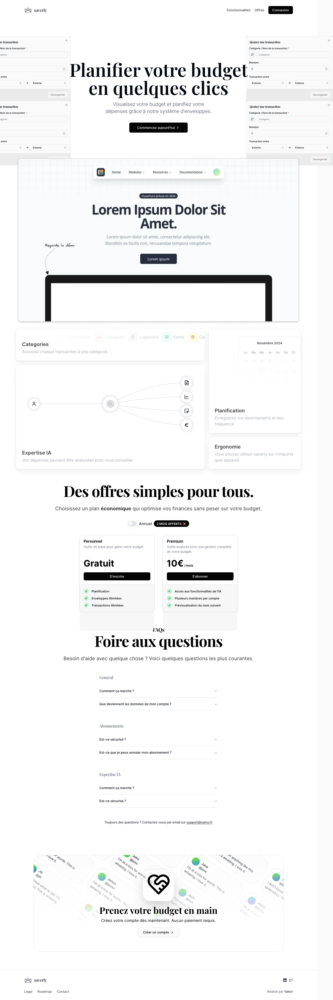

<Toc group="saverly" />

<Wip>
    **Progression**
    - [x] LocalFirst avec replicache 
    - [x] Abonnements avec lemonsqueezy 
    - [x] custom auth avec clerk elements
    - [x] Charts / Filtres avec recharts 
</Wip>

# Quelques images et vidéos

Pour la page d'accueil l'objectif était d'avoir un style "argent", pour ça j'ai utilisé une police avec serif pour les titres

La capture d'écran a quelques problèmes, mais vous pouvez avoir une idée de ce que ça ressemble.

--- 

J'ai aussi voulu tester des animations avec [framer-motion](https://www.framer.com/motion/?ref=vahor.fr), les "cartes" de la section hero sont animés lors du scroll.

<Video src="../../../../public/projects/saverly.fr/homepage-animations.mp4" title="Animations de la page d'accueil"  loop />

Les autres animations viennent de [magic ui](https://magicui.design/?ref=vahor.fr).

---

Et finalement, l'onboarding et une petite démo de l'application.

<Video src="../../../../public/projects/saverly.fr/demo.mp4" title="Onboarding de saverly"  controls />

La vidéo est un peu longue, au sommaire:

1. On commence par un onboarding
    1. Demander un nom
    2. Création d'une enveloppe
    3. Création d'une transaction
    4. Création d'un abonnement

Chaque étape est animée avec un swipe de droite à gauche lorsqu'on passe à la page suivante (inversement si on clique sur retour)

2. On arrive sur le dashboard
    1. On voit les graphs, les listes.
    2. On peut modifier les transactions
    3. On peut ajouter des abonnements
    4. Et filtrer par date

Ici toute la donnée est stockée en local et synchronisée avec le serveur, ce qui permet d'avoir aucun chargement, ou spinner lors des modifications.

---

Une partie que j'apprécie particulièrement est le modal de création d'abonnement.

<Video src="../../../../public/projects/saverly.fr/modal-abonnement.mp4" title="Modal de création d'abonnement"  loop />

L'affichage des prochaines executions, les détails sur les "s" lorsqu'il y a plusieurs jours, les icons, filtres.. tous ces détails sans aucun chargement sont parfaits.

