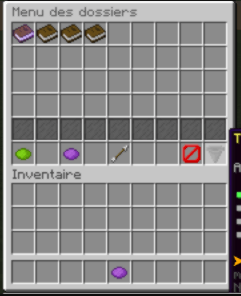
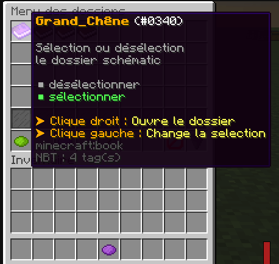

# Informations

<UrlPreview url="https://github.com/Vahor/SimpleSchematics"/>

## Fonctions

- Créer des schematics
- Rotation automatique lors de l’application du schematic
- Prévisualisation du schematic dans la description de l’objet
- Sauvegarde des schematics dans des dossiers avec icons customisables
- Traductions de tous les messages à l’aide d’un fichier `messages.properties`

## Dépendances

- WorldEdit *(FastAsyncWorldEdit)*
- Spigot 1.8+ *(testé sur 1.8 → 1.12)*

## Permissions

- simpleschematics.default\
    Donne accès à toutes les commandes liées au plugin

# Commandes principales

### \/s schematic create \<dossier> \<nom>

Sauvegarde la sélection actuelle dans un fichier.

```bash 
/s schematic create trees.small test
```

<Callout title="Résulat">
    Cette commande va sauvegarder la sélection dans le fichier `test.schematics`.
    Ce fichier sera situé dans le dossier `small`, lui même dans le dossier `trees`. 

    *Chemin final `{rootFolder}/trees/small/test.schematics`*
</Callout>

### \/s to

Envoie votre sélection vers WorldEdit.

### \/s from

Import une sélection WorldEdit.


### \/s trim [-c]

Redimensionne la zone de sélection au plus proche de la construction.\
Avec le flag `-c` des coins sont ajoutés.

<Vimeo id="722709583" title="Trim demo"/>

## Menus

### Menu Principal



#### Actions

<Callout title="Information">
    Les action sont les éléments en bas de l'image.<br/>
    Ils vont être présenté de gauche à droite.
</Callout>


##### Activer l’auto rotation des schematics

Lorsque cette option est désactivée, la copie se fait avec un angle aléatoire *(multiple de 90°)*.\
L'objet passe au vert lorsqu'il est actif.

##### TODO

##### Page précédente

Symbolisé par une flèche, ce bouton permet de retourner au dossier parent.

##### Tout sélectionner

Permet de sélectionner ou de déselectionner les schématics affichés.

##### Filtre

Permet de filtrer la liste: par ordre `alphabétique` ou par `date de création`.

### Liste de schématics

<Callout title="Information">
    Similaire à une structure de fichier, il y a des dossiers et des schématics.

    Un dossier est représenté par un livre, un schématic par une carte.
</Callout>




## Configuration par dossier

```yaml showLineNumbers
material: SKULL_ITEM
data: 3
skull_base64: <base64>
generate_thumbnail: false
```

#### `generate_thumbnail`


----

## TODOs

- si possible rendre la description de l'item rotation plus joli 
- Auto import/remove schematics when something change in folders
- Add javadoc
- Add sound on inventory clicks
- Add interface for API. And remove statics
- Doc: Ajouter la configuration de base

